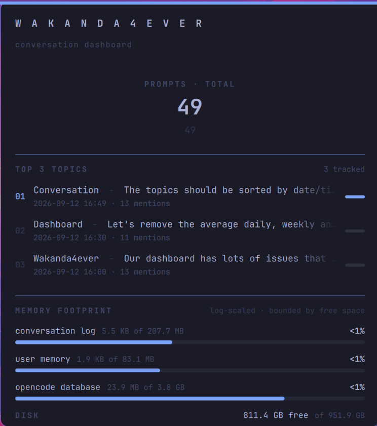

# Wakanda4Ever — OpenCode Conversation Dashboard

> **"We'll always do more 😜"**

A pocket-sized **Omarchy** bar & panel plugin that turns your **OpenCode**
session history into a living, breathing dashboard right on your desktop —
prompt counts, your latest session titles & timestamps, and the storage
footprint of your memory files, all in your Omarchy theme.

<br>



<br>

## Demo / Usage

```sh
# from the plugin folder
omarchy plugin add /path/to/omarchy-opencode-wakanda4ever --enable
omarchy restart shell
```

A **Wakanda4Ever** button shows up in your bar. Click it to open the
dashboard:

- **PROMPT / PROMPTS** — how many prompts OpenCode has ever processed (compact
  `1.2k` big number, `PROMPT` when there's exactly one)
- **RECENT SESSIONS** — your latest 3 OpenCode sessions, each with its title
  and the date/time it was started, newest activity first
- **MEMORY FOOTPRINT** — a log-scaled look at your `conversation-log.md`,
  `user-memory.md`, and the `opencode.db` database vs. a bounded budget
  (never more than `0.5%` of your free disk space)
- **DISK** — total / free / used space on your home filesystem

The panel refreshes quietly every `60s` while open, and closes when you click
outside the card.

<br>

## Installation details

The plugin also ships with an idempotent setup script that configures
**OpenCode persistence**, so the dashboard always has real data to show:

```sh
bash setup.sh
```

`setup.sh` will (only when missing, never overwrites):

1. create `~/.config/opencode/user-memory.md` **long-term memory template**,
2. create `~/.config/opencode/conversation-log.md` **timeline template**,
3. patch `~/.config/opencode/opencode.json` so OpenCode auto-loads
   `user-memory.md` as long-term instructions every session.

> **NOTE:** you only need this once — after that, your OpenCode memory files
> live on (and grow) silently in the background.

Afterwards, **restart opencode** (and `omarchy restart shell`) to apply.

<br>


## Uninstall

```sh
omarchy plugin remove wakanda4ever --yes
omarchy restart shell
```

Uninstalling only removes the plugin (bar button, panel & collector) from your
shell. **Your data is not touched** and goes right back on screen if you ever
re-install it:

- `~/.config/opencode/user-memory.md`, `~/.config/opencode/conversation-log.md`
  and the `opencode.json` instruction tweak — the OpenCode persistence set up
  by `setup.sh`,
- `~/.local/share/opencode/opencode.db` — OpenCode's own session history,
  which the dashboard only reads (it keeps almost nothing of its own).

<br>

## Permanent delete (full data purge)

To wipe **everything** Wakanda4Ever ever stored — plugin and the `setup.sh`
persistence — run:

```sh
# 1. remove & unload the plugin from the shell
omarchy plugin remove wakanda4ever --yes

# 2. remove the OpenCode memory files created by setup.sh
rm -f ~/.config/opencode/user-memory.md ~/.config/opencode/conversation-log.md

# 3. undo the `opencode.json` instruction tweak (drops the user-memory entry,
#    keeping any other instructions & settings intact) - safe to run even if
#    setup.sh was never used (jq fails silently, nothing gets overwritten)
jq --arg um "$HOME/.config/opencode/user-memory.md" \
   '(.instructions // null) as $c
    | if $c == null then .
      elif ($c | type) == "string"
        then if $c == $um then .instructions = [] else . end
      else .instructions = ($c | map(select(. != $um))) end' \
   "$HOME/.config/opencode/opencode.json" > "$HOME/.config/opencode/opencode.json.tmp" \
   && mv "$HOME/.config/opencode/opencode.json.tmp" "$HOME/.config/opencode/opencode.json"

# 4. reload the shell once everything is gone
omarchy restart shell
```

> **⚠️ Deliberately NOT included:** `~/.local/share/opencode/opencode.db` is
> OpenCode's **entire session history** — deleting it erases all your
> conversations & prompts, not just the dashboard's counts. Only do this if
> you really want a brand-new OpenCode:

```sh
rm -f ~/.local/share/opencode/opencode.db \
      ~/.local/share/opencode/opencode.db-wal \
      ~/.local/share/opencode/opencode.db-shm
```

<br>


## How the data is collected

Everything runs on your machine, no cloud involved:

- `collect.py` queries the local OpenCode SQLite database (`opencode.db`) in
  **read-only** mode to count `user` prompts and list the latest 3 sessions.
- It skips sub-agent & archived sessions, stamps each with its start date and
  time, and prints a single JSON payload to stdout for the QML panel to
  consume.

<br>

## Files

```
LICENSE                # MIT license
manifest.json          # plugin manifest (panel + bar-widget)
BarWidget.qml          # bar button that toggles the dashboard
Main.qml               # the dashboard panel (overlay window + card UI)
collect.py             # python collector that feeds the dashboard
setup.sh               # idempotent OpenCode persistence setup
templates/
  user-memory.md       # long-term memory template (auto-loaded by opencode)
  conversation-log.md  # timeline template (append-only session log)
```

<br>

## TODOs

- [ ] **Optimize** the opencode database (e.g. `VACUUM`, wal-checkpointing)
- [ ] **Create a graph** that shows the lifetime of prompt count per day,
      relative to each month of the current year

<br>

## License

MIT — see [LICENSE](LICENSE) (and each file header). **Wakanda Forever 🫶🏼**
